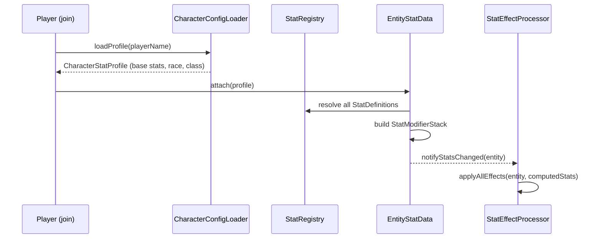
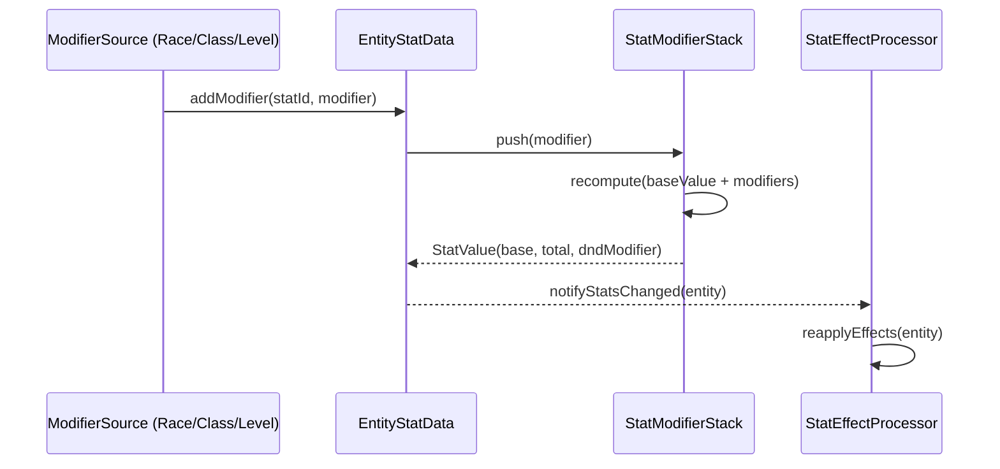

# Design Document: Player Stats System

## Overview

Система характеристик (stats) для BoundByFate-Core — это центральный API-слой, реализующий D&D 5e-подобные атрибуты (STR, CON, DEX, INT, WIS, CHA) для игроков и мобов. Система хранит базовые значения характеристик, применяет модификаторы из внешних источников (раса, класс, уровень, эффекты), вычисляет D&D-модификаторы и транслирует итоговые значения в механики Minecraft через гибкий слой эффектов.

Архитектура намеренно расширяема: характеристики — это не enum, а реестр именованных объектов, что позволяет добавлять новые атрибуты без изменения ядра. Слой эффектов (StatEffect) отделён от данных и позволяет подключать любые Minecraft-механики (HP, скорость, урон, EntityAttribute и т.д.).

## Architecture

```mermaid
graph TD
    subgraph Config Layer
        CF[character_configs/*.json] --> CL[CharacterConfigLoader]
        MF[mob_configs/*.json] --> ML[MobStatConfigLoader]
    end

    subgraph Core API
        SR[StatRegistry] --> SD[StatDefinition]
        CL --> CSP[CharacterStatProfile]
        ML --> MSP[MobStatProfile]
    end

    subgraph Data Layer
        CSP --> ESSD[EntityStatData\nFabric Attachment]
        MSP --> ESSD
        ESSD --> SM[StatModifierStack]
        SM --> SV[StatValue - computed]
    end

    subgraph Effect Layer
        SV --> SEP[StatEffectProcessor]
        SEP --> EAE[EntityAttributeEffect]
        SEP --> HPE[MaxHealthEffect]
        SEP --> SPE[SpeedEffect]
        SEP --> DME[DamageEffect]
        SEP --> CEF[CustomEffect - extensible]
    end

    subgraph Commands
        CMD[/bbf stats ...] --> ESSD
    end
```

## Sequence Diagrams

### Загрузка персонажа при входе на сервер



### Применение модификатора (например, бонус от расы)



## Components and Interfaces

### StatDefinition — описание характеристики

**Purpose**: Неизменяемый дескриптор характеристики. Регистрируется в `StatRegistry`. Не хранит значений.

```kotlin
data class StatDefinition(
    val id: Identifier,          // "boundbyfate-core:strength"
    val shortName: String,       // "STR"
    val displayName: String,     // "Сила"
    val minValue: Int = 1,
    val maxValue: Int = 30,
    val defaultValue: Int = 10,
    val effects: List<StatEffectBinding> = emptyList()
)
```

### StatRegistry — реестр характеристик

**Purpose**: Центральный реестр всех `StatDefinition`. Позволяет добавлять кастомные характеристики.

```kotlin
object StatRegistry {
    fun register(definition: StatDefinition): StatDefinition
    fun get(id: Identifier): StatDefinition?
    fun getOrThrow(id: Identifier): StatDefinition
    fun getAll(): Collection<StatDefinition>
}
```

**Встроенные характеристики** регистрируются при инициализации мода через `BbfStats`:

```kotlin
object BbfStats {
    val STRENGTH:     StatDefinition  // boundbyfate-core:strength
    val CONSTITUTION: StatDefinition  // boundbyfate-core:constitution
    val DEXTERITY:    StatDefinition  // boundbyfate-core:dexterity
    val INTELLIGENCE: StatDefinition  // boundbyfate-core:intelligence
    val WISDOM:       StatDefinition  // boundbyfate-core:wisdom
    val CHARISMA:     StatDefinition  // boundbyfate-core:charisma
}
```

### StatValue — вычисленное значение характеристики

**Purpose**: Иммутабельный снимок итогового значения характеристики с D&D-модификатором.

```kotlin
data class StatValue(
    val base: Int,
    val total: Int,       // base + sum(modifiers)
    val dndModifier: Int  // floor((total - 10) / 2)
) {
    companion object {
        fun compute(base: Int, modifiers: List<StatModifier>): StatValue
    }
}
```

### StatModifier — источник изменения характеристики

**Purpose**: Описывает одно изменение значения характеристики с указанием источника и типа.

```kotlin
data class StatModifier(
    val sourceId: Identifier,   // "boundbyfate-core:race_elf", "boundbyfate-core:level_bonus"
    val type: ModifierType,
    val value: Int
)

enum class ModifierType {
    FLAT,       // +value к total
    OVERRIDE    // заменяет base (для admin-set)
}
```

### EntityStatData — данные характеристик сущности

**Purpose**: Fabric Data Attachment, хранящий базовые значения и стек модификаторов для одной сущности (игрок или моб).

```kotlin
data class EntityStatData(
    val baseStats: Map<Identifier, Int>,           // statId -> base value
    val modifiers: Map<Identifier, List<StatModifier>> // statId -> modifiers
) {
    fun getStatValue(statId: Identifier): StatValue
    fun withBase(statId: Identifier, value: Int): EntityStatData
    fun withModifier(statId: Identifier, modifier: StatModifier): EntityStatData
    fun withoutModifiersFrom(sourceId: Identifier): EntityStatData
    fun getAllStats(): Map<Identifier, StatValue>
}
```

### StatEffectBinding — привязка эффекта к характеристике

**Purpose**: Декларирует, какой `StatEffect` применяется при изменении `StatDefinition`.

```kotlin
data class StatEffectBinding(
    val effect: StatEffect,
    val statId: Identifier
)
```

### StatEffect — интерфейс эффекта

**Purpose**: Применяет вычисленное значение характеристики к Minecraft-сущности. Полностью расширяем.

```kotlin
fun interface StatEffect {
    fun apply(entity: LivingEntity, statValue: StatValue)
}
```

**Встроенные реализации:**

```kotlin
// Изменяет EntityAttribute через AttributeModifier
class EntityAttributeStatEffect(
    val attribute: EntityAttribute,
    val formula: (StatValue) -> Double
) : StatEffect

// Устанавливает максимальное HP
object MaxHealthStatEffect : StatEffect {
    // formula: base 20 HP + CON modifier * 2
    override fun apply(entity: LivingEntity, statValue: StatValue)
}

// Изменяет скорость передвижения
object MovementSpeedStatEffect : StatEffect

// Применяет StatusEffect с амплитудой от модификатора
class StatusEffectStatEffect(
    val statusEffect: StatusEffect,
    val amplifierFormula: (StatValue) -> Int
) : StatEffect
```

### StatEffectProcessor — применение эффектов

**Purpose**: Слушает изменения `EntityStatData` и переприменяет все эффекты.

```kotlin
object StatEffectProcessor {
    fun applyAll(entity: LivingEntity, statsData: EntityStatData)
    fun reapply(entity: LivingEntity, statId: Identifier, statsData: EntityStatData)
}
```

## Data Models

### CharacterStatProfile — конфиг персонажа (из файла)

```kotlin
data class CharacterStatProfile(
    val playerName: String,
    val race: Identifier,
    val characterClass: Identifier,
    val startingLevel: Int,
    val baseStats: Map<Identifier, Int>  // statId -> value
)
```

**Validation Rules:**
- `playerName` — непустая строка, совпадает с ником игрока
- `baseStats` — все значения в диапазоне `[StatDefinition.minValue, StatDefinition.maxValue]`
- `startingLevel` — в диапазоне `[1, 20]`

### MobStatProfile — конфиг моба (из файла)

```kotlin
data class MobStatProfile(
    val mobTypeId: Identifier,   // "minecraft:zombie"
    val baseStats: Map<Identifier, Int>
)
```

### Codec / Persistence

`EntityStatData` сериализуется через Fabric Data Attachment API + Codec (аналогично `PlayerLevelData`):

```kotlin
// В BbfAttachments
val ENTITY_STATS: AttachmentType<EntityStatData> = AttachmentRegistry.createPersistent(
    Identifier("boundbyfate-core", "entity_stats"),
    EntityStatData.CODEC
)
```

## Config File Format

Конфиги хранятся в директории мира: `world/boundbyfate/characters/` и `world/boundbyfate/mobs/`.

### Пример character config (`world/boundbyfate/characters/Steve.json`):

```json
{
  "playerName": "Steve",
  "race": "boundbyfate-core:human",
  "class": "boundbyfate-core:fighter",
  "startingLevel": 1,
  "baseStats": {
    "boundbyfate-core:strength":     15,
    "boundbyfate-core:constitution": 14,
    "boundbyfate-core:dexterity":    13,
    "boundbyfate-core:intelligence": 10,
    "boundbyfate-core:wisdom":       12,
    "boundbyfate-core:charisma":     8
  }
}
```

### Пример mob config (`world/boundbyfate/mobs/minecraft_zombie.json`):

```json
{
  "mobTypeId": "minecraft:zombie",
  "baseStats": {
    "boundbyfate-core:strength":     13,
    "boundbyfate-core:constitution": 15,
    "boundbyfate-core:dexterity":    8
  }
}
```

## Key Functions with Formal Specifications

### StatValue.compute()

```kotlin
fun compute(base: Int, modifiers: List<StatModifier>): StatValue
```

**Preconditions:**
- `base >= 1`
- `modifiers` может быть пустым

**Postconditions:**
- `total = base + sum(m.value for m in modifiers where m.type == FLAT)`
- `dndModifier = floor((total - 10) / 2)`
- `total` зажат в `[StatDefinition.minValue, StatDefinition.maxValue]`

### EntityStatData.getStatValue()

```kotlin
fun getStatValue(statId: Identifier): StatValue
```

**Preconditions:**
- `statId` зарегистрирован в `StatRegistry`

**Postconditions:**
- Возвращает `StatValue` с корректно вычисленным `dndModifier`
- Если `baseStats` не содержит `statId` — использует `StatDefinition.defaultValue`

### StatEffectProcessor.applyAll()

```kotlin
fun applyAll(entity: LivingEntity, statsData: EntityStatData)
```

**Preconditions:**
- `entity` не null, находится в живом состоянии
- `statsData` содержит корректные значения

**Postconditions:**
- Все `StatEffect` из всех `StatDefinition.effects` применены к `entity`
- Предыдущие AttributeModifier от BoundByFate удалены перед повторным применением (идемпотентность)

**Loop Invariants:**
- Для каждой итерации по `StatDefinition`: все ранее обработанные характеристики уже применены к entity

## Algorithmic Pseudocode

### Алгоритм загрузки персонажа при входе

```pascal
PROCEDURE onPlayerJoin(player: ServerPlayerEntity)
  INPUT: player
  OUTPUT: side-effect — EntityStatData прикреплён к player

  SEQUENCE
    profile ← CharacterConfigLoader.load(player.name)

    IF profile IS NULL THEN
      LOG warning "No character config for " + player.name
      RETURN
    END IF

    statsData ← EntityStatData(
      baseStats = profile.baseStats,
      modifiers = emptyMap()
    )

    // Применяем расовые бонусы
    raceModifiers ← RaceRegistry.getModifiers(profile.race)
    FOR each (statId, mod) IN raceModifiers DO
      statsData ← statsData.withModifier(statId, mod)
    END FOR

    // Применяем классовые бонусы
    classModifiers ← ClassRegistry.getModifiers(profile.characterClass)
    FOR each (statId, mod) IN classModifiers DO
      statsData ← statsData.withModifier(statId, mod)
    END FOR

    player.setAttached(BbfAttachments.ENTITY_STATS, statsData)
    StatEffectProcessor.applyAll(player, statsData)
  END SEQUENCE
END PROCEDURE
```

### Алгоритм вычисления StatValue

```pascal
FUNCTION computeStatValue(base: Int, modifiers: List<StatModifier>, def: StatDefinition): StatValue
  INPUT: base, modifiers, def
  OUTPUT: StatValue

  SEQUENCE
    flatSum ← 0
    FOR each mod IN modifiers DO
      IF mod.type = FLAT THEN
        flatSum ← flatSum + mod.value
      ELSE IF mod.type = OVERRIDE THEN
        base ← mod.value  // последний OVERRIDE побеждает
      END IF
    END FOR

    total ← clamp(base + flatSum, def.minValue, def.maxValue)
    dndMod ← floor((total - 10) / 2)

    RETURN StatValue(base, total, dndMod)
  END SEQUENCE
END FUNCTION
```

### Алгоритм применения эффектов

```pascal
PROCEDURE applyAll(entity: LivingEntity, statsData: EntityStatData)
  INPUT: entity, statsData
  OUTPUT: side-effect — Minecraft-атрибуты entity обновлены

  SEQUENCE
    // Сначала снимаем все старые BbfAttributeModifier
    removeAllBbfModifiers(entity)

    FOR each statDef IN StatRegistry.getAll() DO
      statValue ← statsData.getStatValue(statDef.id)

      FOR each binding IN statDef.effects DO
        binding.effect.apply(entity, statValue)
      END FOR
    END FOR
  END SEQUENCE
END PROCEDURE
```

## Error Handling

### Отсутствует конфиг персонажа

**Condition**: Игрок подключается, но `characters/{name}.json` не найден  
**Response**: Логируем WARN, игрок получает дефолтные значения из `StatDefinition.defaultValue`  
**Recovery**: Администратор создаёт конфиг и перезагружает через `/bbf stats reload`

### Некорректное значение в конфиге

**Condition**: Значение характеристики выходит за `[minValue, maxValue]`  
**Response**: Значение зажимается (`coerceIn`), логируется WARN с указанием файла и поля  
**Recovery**: Автоматически, без краша сервера

### Неизвестный `statId` в конфиге

**Condition**: Конфиг ссылается на `statId`, не зарегистрированный в `StatRegistry`  
**Response**: Поле игнорируется, логируется WARN  
**Recovery**: Автоматически

### Моб без конфига

**Condition**: Моб спавнится без соответствующего `mob_config`  
**Response**: Моб получает только дефолтные значения, эффекты не применяются  
**Recovery**: Администратор добавляет конфиг и перезагружает

## Testing Strategy

### Unit Testing

- `StatValue.compute()` — проверка формулы D&D модификатора для граничных значений (1, 10, 20, 30)
- `EntityStatData.withModifier()` / `withoutModifiersFrom()` — иммутабельность, корректность стека
- `CharacterConfigLoader` — парсинг валидных и невалидных JSON

### Property-Based Testing

**Property Test Library**: `kotest-property`

- Для любого `total ∈ [1, 30]`: `dndModifier = floor((total - 10) / 2)`
- Для любого набора FLAT-модификаторов: `StatValue.total = clamp(base + sum, min, max)`
- `withModifier` + `withoutModifiersFrom` — идемпотентность удаления

### Integration Testing

- Загрузка персонажа при join → проверка, что `EntityStatData` прикреплён и эффекты применены
- Команда `/bbf stats set STR 18` → проверка обновления attachment и EntityAttribute

## Performance Considerations

- `EntityStatData` — иммутабельный data class, пересчёт только при изменении модификаторов
- `StatEffectProcessor.applyAll()` вызывается только при изменении стека, не каждый тик
- Конфиги загружаются один раз при старте сервера / команде reload, кешируются в памяти

## Security Considerations

- Команды изменения характеристик требуют `permissionLevel >= 2` (оператор)
- Конфиг-файлы читаются только сервером, игроки не могут их изменить напрямую
- Значения зажимаются в `[minValue, maxValue]` — нет возможности установить невалидные значения через команду

## Dependencies

- `net.fabricmc.fabric-api` — Data Attachment API, Event API
- `net.fabricmc:fabric-language-kotlin` — Kotlin runtime
- `com.mojang:serialization` (Codec) — уже используется в проекте
- Опционально в будущем: Origins API (для расовых бонусов)
